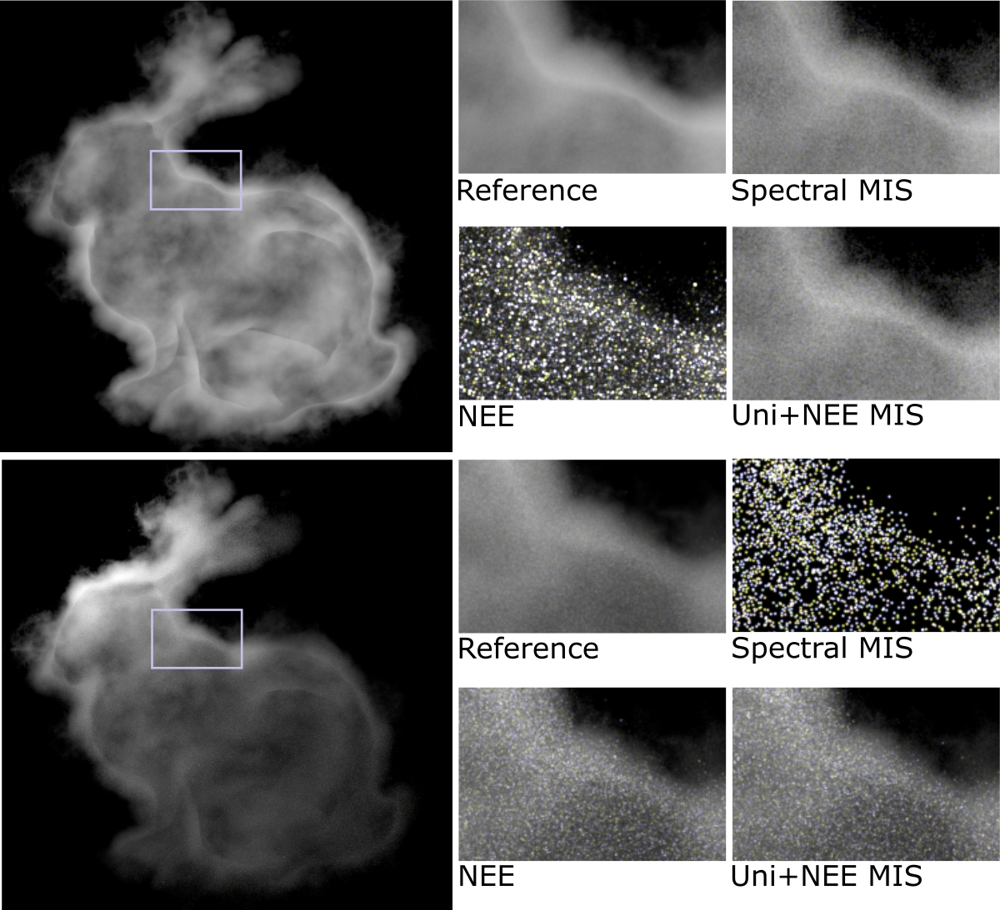
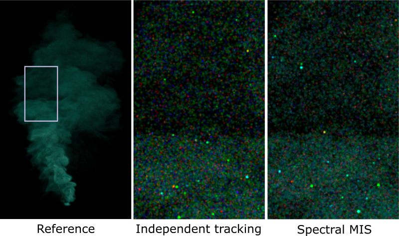
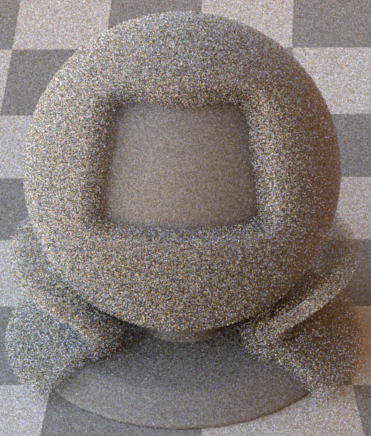

This project was done at [EPFL](https://www.epfl.ch/en/) at the [Realistic Graphics Lab](https://rgl.epfl.ch/) under the supervision of [Wenzel Jakob](https://rgl.epfl.ch/people/wjakob) and [Tizian Zeltner](https://tizianzeltner.com/). Source code is not yet available. Project report with more detailed explanations can be found [here](project_report.pdf).

# Motivation

A paper by [Miller et al. (2019)](https://dl.acm.org/doi/pdf/10.1145/3306346.3323025) presents a novel way of formulating the path-space version of the volume rendering equation. Their new formulation provides pdfs of full paths in both homogeneous and heterogeneous media for the first time. It also treats both homogeneous and heterogeneous media by the same formula.

As a result, new ways of combining path sampling strategies in heterogeneous media via multiple importance sampling (MIS) are possible. This can potentially lead to better rendering performance. Another advantage is that rendering software can be simplified because integrators which solve the new formulation are more robust.

The goal of this project is to implement the new formulation in Mitsuba 2, an upcoming version of a widely used research-oriented renderer. Then, it is important to evaluate the benefits and drawbacks of the implementation which will ultimately help to decide whether it should be used in Mitsuba 2 by default.

# Results

We have reproduced results and figures from the original paper to verify that our implementation works. All images on this page are rendered in Mitsuba 2.

First, here are two scenes of a bunny-shaped cloud. The upper one is back-lit by a large are light source. This makes it easy to render using brute-force path tracing (_Spectral MIS_ in the figure), but difficult using next-event estimation (_NEE_ in the figure). The lower scene is side-lit by a much smaller light source. Such a scene is difficult for brute-force path tracing, but easy for next-event estimation. Because the new path integral formulation gives us full path pdfs for both method, we can combine them using MIS in an integrator which is more robust and renderes both scenes well (_Uni+NEE MIS_ in the figure).

Next, we have a scene containing a spectrally-varying heterogeneous plume of smoke. There are various methods for unbiased rendering of colorful media, one of them being independent tracking. This method, however, suffers from excessive color noise. [Hero wavelength sampling](https://dl.acm.org/doi/10.1111/cgf.12419) (_Spectral MIS_ in the figure) reduces color noise, but it employs various path sampling techniques which need to be combined via MIS. This has been made possible by the new formulation.

Lastly, we have indentified two main drawbacks of the practical implementation of the new formulation:

* Some path can be absorbed by the medium and are therefore terminated. Because of this, fewer paths contribute to the result than before which leads to slightly more noise. Below, the figure on the left is rendered by a current Mitsuba 2 integrator and the figure on the right is rendered by our implementation. Both scenes and path samplin strategies are identical.

 

* Because we now need to keep track of multiple full path pdfs for MIS, there are issues with accumulating them into a single-precision floating point variable. In dense media, the value after 40 bounces can easily become larger than 10^40 which is larger than the maximum that can be stored in such variables. [Miller (2019)](https://github.com/baileymiller/nullpath) uses a simple trick to solve this issue, but this increases time complexity and is also specific to the balance heuristic of MIS. A different trick would have to be used to enable power heuristic.

# Technical Details

More details can be found in the [project report](project_report.pdf).
